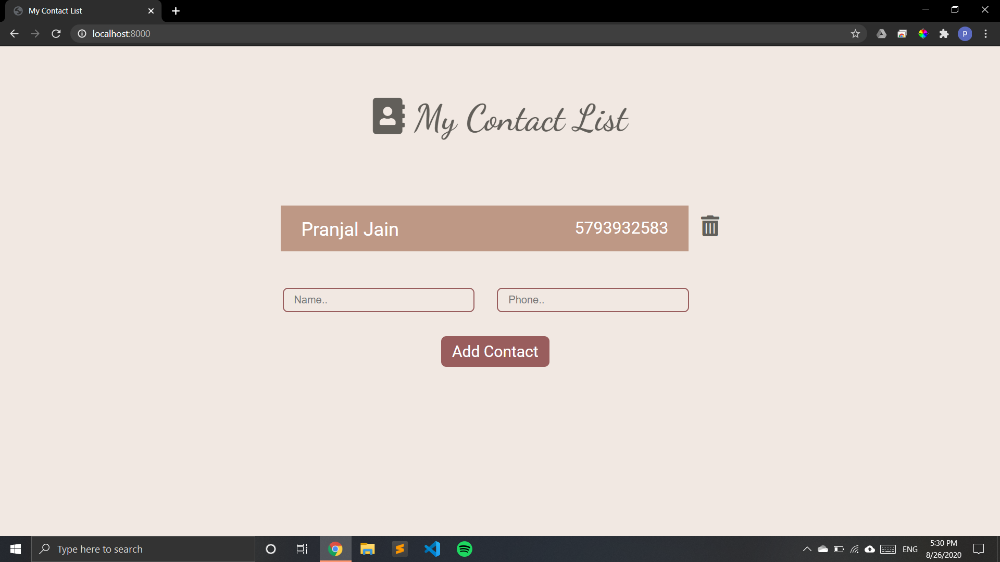
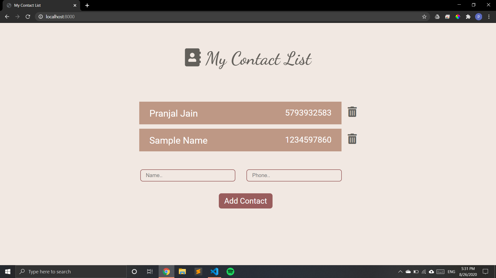
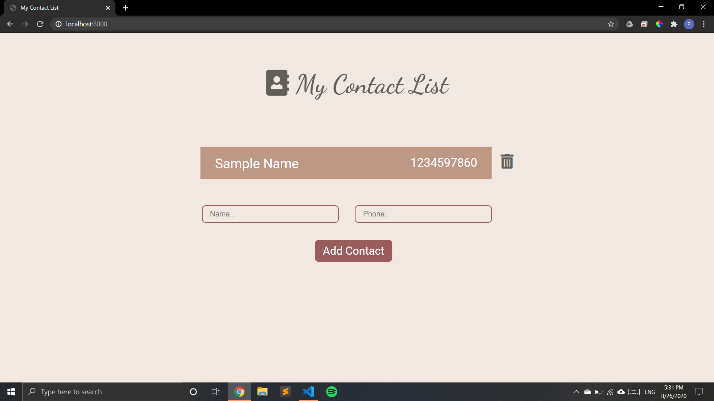

# contactList
A basic contact list which lets you add and delete contacts. it is made using node js and express js is used as framework. 

## To run this app, the following scripts are available:

### `npm install`

Installs the required dependencies to run the app

### `node index.js`

Will start the server at [http://localhost:3000](http://localhost:3000) 

## Screenshots:

### Contact List

### Add Contact

 

### Delete Contact

 
